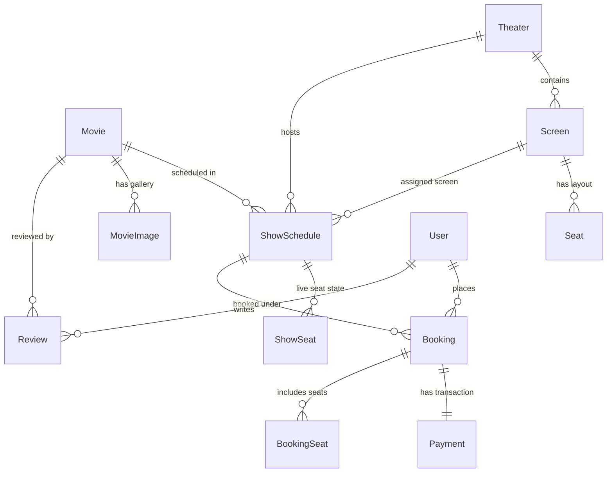

# 🎬 BookMySeat - Movie Ticket Booking & Cinema Management System

A full-stack, enterprise-grade movie ticket booking and cinema management platform built with **Django**, **Celery**, **Redis**, and **Razorpay**. Inspired by **BookMyShow**, this application features real-time seat reservation locking, multi-screen theater layout engines, dynamic PDF ticket generation with QR code validation, automated multi-transport email delivery, verified buyer reviews, and an executive analytics dashboard for cinema operators.

---

## 🚀 Key Features

### 🍿 1. User Experience & Catalog Exploration
- **Dynamic Content Discovery**: Filter movies by Status (*Now Showing*, *Upcoming*, *Ended*), Age Certification (*U*, *U/A*, *U/A 13+*, *A*), Genre, and Language.
- **Rich Movie Pages**: Embedded YouTube trailers, high-resolution poster gallery, cast & crew details, duration formatting, and customer ratings.
- **Multi-Screen Theater Support**: Browse movie showtimes across venues and screen formats (2D, 3D, IMAX 3D, 4DX, Dolby Atmos).

### 🎟️ 2. Interactive Seating & Real-Time Hold Locks
- **Interactive Seat Map Grid**: Screen layouts categorized into Tiered Pricing tiers (*Executive/Regular*, *Premium*, *Recliner/VIP*).
- **2-Minute Temporary Seat Hold**: Automated expiration & release of reserved seats to maximize occupancy and prevent double-booking.
- **Concurrency & Race-Condition Guard**: Row-level locking powered by Django ORM `select_for_update()` inside `transaction.atomic()` blocks.

### 💳 3. Razorpay Payments & Webhook Processing
- **Razorpay Gateway Integration**: Server-side payment order creation and checkout modal integration.
- **HMAC-SHA256 Signature Verification**: Secure server-side signature validation for payment confirmation.
- **CSRF-Exempt Webhooks**: Automated payment status updates via background webhook endpoints (`/webhooks/razorpay/`).
- **Audit Logging**: Full raw JSON transaction response logging for financial auditability and dispute resolution.

### 📄 4. Digital QR Tickets & Gate Verification
- **Automated PDF Ticket Engine**: Dynamic PDF generation using **ReportLab** containing booking metadata, venue layout, and entry details.
- **Embedded QR Code**: Encrypted entry pass generated via the `qrcode` library.
- **Dual-Storage Resilience**: Stores PDF ticket files on filesystem/cloud storage and directly in PostgreSQL/SQLite `BinaryField` (`ticket_pdf_data`) to prevent data loss on serverless deployments (e.g., Vercel).
- **Gatekeeper Verification API**: Staff scanner endpoint (`/movies/booking/<booking_reference>/verify/`) to authenticate tickets at cinema entry gates.

### 📧 5. Asynchronous Email Delivery System
- **Background Processing**: Asynchronous task queue handling powered by **Celery** and **Redis**.
- **Multi-Transport Failover Cascade**: Resilient email dispatch pipeline with automatic failover:
  1. **Brevo REST API** (HTTPS Port 443 — serverless compatible)
  2. **MailerSend REST API**
  3. **Resend REST API**
  4. **Django Email Backend** (SMTP / Console)
- **Rich HTML & PDF Attachments**: Delivers branded email passes with attached PDF tickets.

### ⭐ 6. Verified Buyer Reviews & Moderation
- **Verified Purchase Enforcement**: Reviews restricted exclusively to users with a confirmed booking after their showtime has passed.
- **Rating Aggregations**: Automatic recalculation of movie average star ratings upon review submission or deletion.
- **Community Moderation System**: User report flagging for offensive or spam reviews with an administrative moderation workflow.

### 📊 7. Executive Analytics & Cinema Management Dashboard
- **Protected Staff Portal**: Accessible at `/movies/manage/` guarded by custom `@staff_or_admin_required` authorization decorators.
- **Business Insights & Visual Charts**:
  - **Revenue Analytics**: Daily, Weekly, Monthly, Yearly, and Custom Date Range aggregations.
  - **Booking Trends**: Daily ticket volume and revenue tracking using `TruncDate`.
  - **Occupancy Metrics**: Percentage seat utilization across theater screens `(Booked / Capacity) * 100`.
  - **Top Performing Content**: Leaderboards for highest-grossing movies and venues.
  - **Peak Booking Hours**: Hourly sales distribution analysis using `ExtractHour`.
  - **User Registration Trends**: Growth metrics grouped by `TruncMonth`.
- **Low-Memory Streaming CSV Exports**: Chunked database streaming exports via `StreamingHttpResponse` and `iterator(chunk_size=2000)` for handling datasets of 100,000+ bookings.
- **Full Catalog CRUD**: Comprehensive management for Movies, Theaters, Screens, Schedules, Bookings, Seats, Taxonomies (Genres, Languages, Cast), and User Reports.

---

## 🛠️ Technology Stack

| Layer | Technology / Tool |
| :--- | :--- |
| **Framework** | [Django 3.2](https://www.djangoproject.com/) |
| **Language** | Python 3.9+ |
| **Database** | PostgreSQL / SQLite3 (with custom B-Tree Indexes) |
| **Async Task Queue** | Celery 5.3 + Redis 5.0 |
| **Payment Gateway** | Razorpay SDK & Webhooks |
| **PDF & Images** | ReportLab 4.2, Pillow 10.3, QRCode 7.4 |
| **Email Transports** | Brevo REST API, MailerSend, Resend, Django Core Mail |
| **Storage & Assets** | WhiteNoise 6.7, Cloudinary Storage |
| **Deployment** | Vercel (`vercel.json`, `build_files.sh`), Gunicorn |

---

## 📂 Project Architecture

```text
djnago-bookmyshow-clone/
├── ADMIN_CREDENTIALS.md       # Admin user login details & dashboard overview
├── build_files.sh             # Build script for static collection & dependencies
├── manage.py                  # Django CLI manager tool
├── requirements.txt           # Project dependencies
├── vercel.json                # Vercel deployment configuration
├── bookmyseat/                # Root Project Configuration
│   ├── settings.py            # Global settings (DB, Cloudinary, Celery, Razorpay)
│   ├── urls.py                # Main URL routing configuration
│   ├── celery.py              # Celery instance initialization
│   ├── wsgi.py & asgi.py      # Server interface gateways
├── movies/                    # Core Cinema & Booking App
│   ├── models.py              # Data models (Movie, Theater, Screen, ShowSchedule, Seat, Booking, Payment, Review)
│   ├── views.py               # Booking workflows & admin dashboard views
│   ├── urls.py                # URL endpoints for movie app
│   ├── reservation_service.py # Atomic seat reservation engine
│   ├── payment_service.py     # Razorpay API & signature verification logic
│   ├── ticket_service.py      # PDF ticket & QR code generation service
│   ├── brevo_service.py       # Multi-transport email API service
│   ├── analytics_service.py   # Business intelligence & ORM aggregation queries
│   ├── csv_export_service.py  # Streaming CSV exporter
│   ├── tasks.py               # Celery async email tasks
│   ├── admin.py               # Django Admin site configuration
├── users/                     # User Authentication & Profile App
│   ├── views.py               # Login, registration, profile, password reset
│   ├── urls.py                # Authentication routing
│   ├── forms.py               # User registration and profile update forms
└── templates/                 # HTML Templates
    ├── home.html              # Main landing page
    ├── movies/                # Booking, seating, ticket & admin dashboard templates
    └── users/                 # Auth & profile templates
```

---

## 🗄️ Core Database Models



---

## ⚡ Quick Start & Local Setup

### Prerequisites
- Python 3.9+ installed
- Redis server running locally or via Docker (for Celery background tasks)
- Git

### 1. Clone the Repository
```bash
git clone https://github.com/your-username/django-bookmyshow-clone.git
cd django-bookmyshow-clone
```

### 2. Create and Activate Virtual Environment
```bash
# Windows
python -m venv venv
venv\Scripts\activate

# Linux / macOS
python3 -m venv venv
source venv/bin/activate
```

### 3. Install Dependencies
```bash
pip install -r requirements.txt
```

### 4. Configure Environment Variables
Create a `.env` file in the root directory (or export environment variables):
```env
SECRET_KEY=your_secret_key_here
DEBUG=True
DATABASE_URL=sqlite:///db.sqlite3

# Razorpay Credentials (Optional for local testing)
RAZORPAY_KEY_ID=your_razorpay_key_id
RAZORPAY_KEY_SECRET=your_razorpay_key_secret
RAZORPAY_WEBHOOK_SECRET=your_webhook_secret

# Email API Credentials (Optional)
BREVO_API_KEY=your_brevo_api_key
DEFAULT_FROM_EMAIL=tickets@bookmyseat.com

# Redis & Celery
CELERY_BROKER_URL=redis://127.0.0.1:6379/0
```

### 5. Run Database Migrations
```bash
python manage.py migrate
```

### 6. Create Superuser (Admin Access)
```bash
python manage.py createsuperuser
```
*(Refer to [`ADMIN_CREDENTIALS.md`](file:///c:/Internship%20BMS/djnago-bookmyshow-clone/ADMIN_CREDENTIALS.md) for existing default admin setup details)*.

### 7. Start Celery Worker (Optional - for Async Emails)
In a separate terminal window:
```bash
celery -A bookmyseat worker --loglevel=info
```

### 8. Run the Development Server
```bash
python manage.py runserver
```

Open your browser and navigate to `http://127.0.0.1:8000/`.

---

## 🔑 Admin Dashboard Access

- **Admin URL**: `http://127.0.0.1:8000/movies/manage/`
- **Django Standard Admin**: `http://127.0.0.1:8000/admin/`

---

## 🌐 API & URL Endpoint Directory

### User & Authentication Routes
| Route | Method | Description |
| :--- | :--- | :--- |
| `/` | `GET` | Home page showcasing movies & search |
| `/register/` | `GET`, `POST` | User registration |
| `/login/` | `GET`, `POST` | User authentication |
| `/logout/` | `POST` | User logout |
| `/profile/` | `GET`, `POST` | User dashboard, booking history & ticket download |

### Movie & Booking Routes
| Route | Method | Description |
| :--- | :--- | :--- |
| `/movies/` | `GET` | Movie catalog list |
| `/movies/<id>/` | `GET` | Movie detail page |
| `/movies/<id>/theaters` | `GET` | Theater and showtime selection |
| `/movies/theater/<id>/seats/book/` | `GET` | Interactive seat selection map |
| `/movies/schedule/<id>/reserve/` | `POST` | Reserve seats (2-min lock) |
| `/movies/schedule/<id>/release/` | `POST` | Release reserved seats |
| `/movies/schedule/<id>/create-payment-order/` | `POST` | Initialize Razorpay payment order |
| `/movies/payment/verify/` | `POST` | Verify Razorpay payment signature & confirm booking |
| `/webhooks/razorpay/` | `POST` | CSRF-exempt Razorpay webhook payment handler |

### Tickets & Verification
| Route | Method | Description |
| :--- | :--- | :--- |
| `/movies/booking/<ref>/ticket/` | `GET` | Stream PDF Ticket download |
| `/movies/booking/<ref>/verify/` | `GET` | Gatekeeper ticket verification endpoint |
| `/movies/booking/<ref>/resend-email/` | `POST` | Resend PDF ticket via email |

### Admin Dashboard Routes (`/movies/manage/`)
| Route | Method | Description |
| :--- | :--- | :--- |
| `/movies/manage/` | `GET` | Analytics dashboard & KPIs |
| `/movies/manage/export/csv/` | `GET` | Streaming CSV export for business analytics |
| `/movies/manage/movies/` | `GET`, `POST` | Manage movie listings |
| `/movies/manage/theaters/` | `GET`, `POST` | Manage theaters & screens |
| `/movies/manage/schedules/` | `GET`, `POST` | Manage show schedules |
| `/movies/manage/bookings/` | `GET`, `POST` | Manage user bookings |
| `/movies/manage/reports/` | `GET`, `POST` | Moderation queue for reported reviews |

---

## 🚢 Deployment (Vercel & Production)

This repository includes pre-configured deployment settings for Vercel:
- [`vercel.json`](file:///c:/Internship%20BMS/djnago-bookmyshow-clone/vercel.json): Defines WSGI serverless build entry points and static asset routing.
- [`build_files.sh`](file:///c:/Internship%20BMS/djnago-bookmyshow-clone/build_files.sh): Executes `pip install` and `python manage.py collectstatic`.

---

## 📝 License

This project is open-source and available under the **MIT License**.
